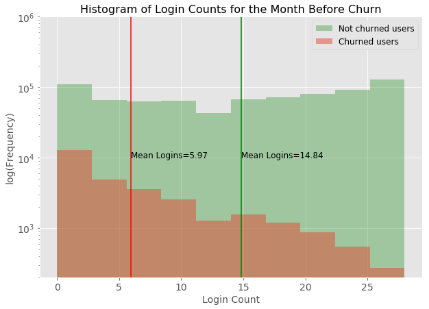
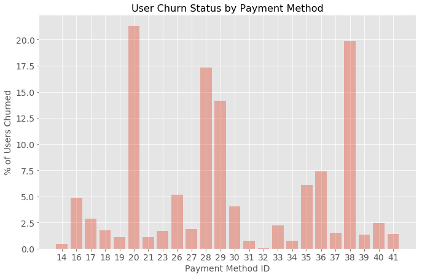
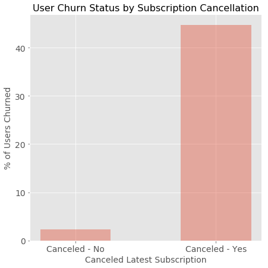
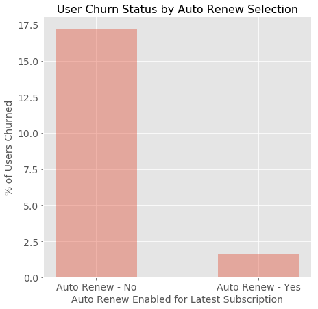
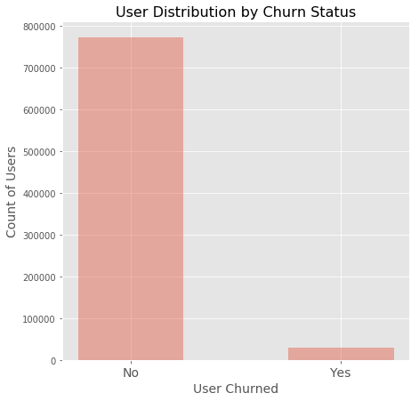
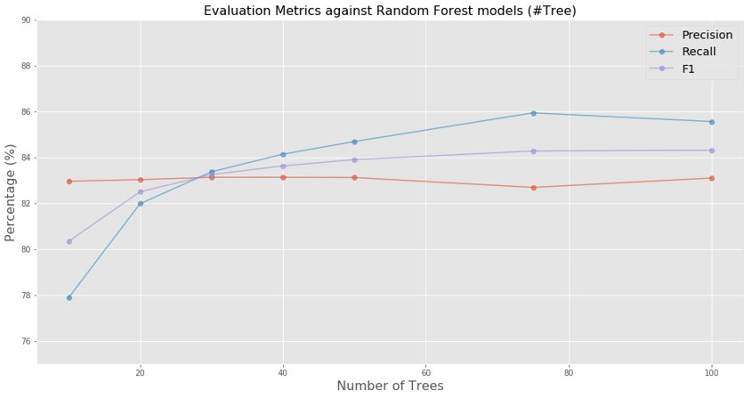
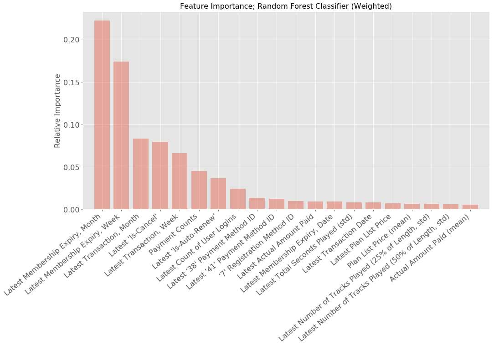

# Churn Prediction: Music Streaming Service

## Abstract

Current studies on customer churn are focused on predicting attrition rather than identifying features leading to attrition. This analysis explores how features leading to customer attrition can be identified and prioritized for an online music service based on a subscription model. Data available for such scenarios typically suffers from class imbalance. Therefore, a significant part of the study was focused on evaluating the performance of different approaches to tackle this problem. Logistic Regression and Random Forest classifiers were evaluated for the problem statement, including tuning to accommodate class imbalance. The optimal model gave an F1 Score of 0.9, and identified features associated with financial activities of the users as being most meaningful in predicting churn.

## Introduction

**Motivation**

Across industries, a key objective of Customer Relationship Management is customer retention, since the cost of customer acquisition is much more than the cost of customer retention (Gallo, 2014). For software companies which operate on a subscription model, the ability to predict customer attrition is even more critical. In this project, we will apply predictive analytics for the music subscription industry, to help predict customers that could be lost. By identifying such customers, companies can make a timely intervention.

**Research Question**

*What customer attributes and behaviors can be used to predict and prevent attrition in the music subscription industry?*

**Literature Review**

The topic of churn prediction has been studied extensively in many different papers across various industries. Euler (2005) used Decision Trees in the telecommunications industry to identify customers who could potentially churn. Larivière & Poel (2005) demonstrated the use of Random Forests to predict customer retention for a financial services company. Shaaban, Helmy, Khedr & Nasr (2012) applied Support Vector Machines for this purpose, on a mobile service provider’s data. Some limitations of the existing practice are:
  * Most studies have been done for the telecommunications and internet service industry, which do not adequately capture the contextual features of a music subscription service.
  * Existing analyses tend to focus on classification algorithms for the churn prediction problem but fall short of identifying customer attributes leading to churn.

## Dataset

Data used in the analysis was provided by KKBOX, a leading music streaming service in Asia. This data was made available by the company as part of a Kaggle competition (11th ACM International Conference on Web Search and Data Mining, 2018). The data can be broadly categorized into the following 3 categories:
  * Usage logs: Music streaming behaviors of the users. Examples are, the total seconds worth of music played by the user, and the number of unique songs that the user listened to partially/fully. These details are captured at a ‘per-login’ level granularity.
  * Transaction logs: Subscription renewal/cancellation related user activities. For instance, whether auto-renew was enabled by the customer, and the membership expiration date.
  * Membership information: Demographic information about the users. These include the user’s geographical location, age and gender among other attributes.

**Churn Criteria**

*A user x in a month y is considered churned if his/her subscription expired in month y-1, and there were no additional transactions for user x within 30 days of the expiry date.*

**Data Preparation**

Several pre-processing steps were performed before the analysis:
  * March 2017 was chosen as the target month for predicting churn. Based on the definition of the churn criteria, this meant assigning ‘churned’/‘not churned’ labels for users whose subscription was due to expire in Feb 2017. Other users were tagged ‘not churned’. 
  * Next, a time frame for the analysis of usage and transaction logs was defined. To simplify this analysis, it was assumed that a period of 6 months up to the subscription expiry month can be considered meaningful for churn prediction. Therefore, the usage and transaction logs were filtered to contain data from September 2016 through to February 2017.
  * Following this step, we aggregated usage and transaction logs so that each row in these datasets corresponds to one user. For usage logs, we chose features such as ‘mean of total seconds of music tuned in to’, and ‘mean of number of songs listened to for 25% of the song duration’. For transaction logs, example features included ‘latest payment plan days’, and ‘total count of payments’. Membership information was already at a ‘per-user’ level, so such aggregation did not have to be performed. Across all 3 types of data, features based on calendar date were broken down into meaningful components like, month of the year, day of the week and week of the year. The final ‘Baseline Dataset’ had features as described in the previous steps, along with churn labels assigned for the users.
  * Further feature engineering was performed on this dataset when it was seen that the results of the analysis models were poor (as discussed in the approach section). As part of this step, features based on usage logs were broken down into multiple month-level features. So, for instance, a feature ‘total_seconds’ in the baseline dataset was transformed into ‘total_seconds_t-1’…‘total_seconds_t-6’, where t = 0 indicates our churn prediction month, i.e. March 2017. Lastly, categorical variables such as gender, city, payment method were one-hot encoded since scikit-learn’s Random Forest classifier does not automatically handle categorical features with more than two levels. Methods discussed in the approach below, referring to ‘Dataset with Engineered Features’ imply using this enhanced dataset.
  
**Exploration**

Figure 1. Histogram of login counts for users in the month before churn (Feb 2017). The plot shows that users who churn have fewer logins, on average.

Figure 2. The proportion of users that churned for some payment methods was higher. The dataset does not provide names corresponding to payment method IDs.

Figure 3. Users that canceled their latest subscription had a higher percentage of churn (more than 40%) compared to users that did not (less than 5%).

Figure 4. Users that had auto-renew enabled for their latest subscription had a higher percentage of churn (around 17%) compared to users that did not (less than 2.5%).

Figure 5. The data has a significant imbalance between users that churned (4%) and those that didn’t (96%).

## Approach

As evident from Figure 5, our data suffers from a significant class imbalance, i.e. the number of users that did not churn is much larger than the number of users that churned. Due to this, the classifier tends to classify almost all the records as the majority class. Defining appropriate evaluation metrics is critical to measure model performance in such cases. Accuracy as a metric can be misleading since even a model classifying all users as ‘not churned’ would be 96% accurate.

The following metrics were therefore chosen for this analysis:
 * Precision: Ratio of true positives to the true positives and false positives, i.e. how true are the predicted positives.
 *	Recall: Ratio of true positives to the actual number of positives. A high recall implies low number of false negatives.
 *	F1 Score: The harmonic mean of precision and recall. A high value ensures that we neither have too many false positives nor too many false negatives
 *	Precision Recall Curve: Shows the tradeoff between precision and recall by choosing different thresholds to classify records into ‘churned’/‘not churned’ classes. A large area under the curve represents both high recall and high precision. 

**Logistic Regression**

We first trained a naïve logistic regression model on the baseline dataset. It was observed that, although the accuracy of this model was 96%, the precision and recall values were 0, indicating poor performance of model to predict the true positives.

**Logistic Regression, with Feature Engineering**

Next, we applied logistic regression on the dataset after adding some engineered features as described before. The criteria used for feature engineering was to break down the user activity features to month level granularity, with the assumption that month-wise features would capture changing behavior of users moving towards subscription expiry more accurately. We then trained a logistic regression model on this dataset and found that our precision (0.51) and recall (0.03) values improved. However the model still performed poorly with an F1 Score of 0.05.

**Logistic Regression, with defined Class Weights**

Thereafter we trained a logistic regression on the same dataset with an additional parameter – class_weight. Adding argument class_weight = ‘balanced’ penalizes mistakes on the minority class by an amount proportional to how under-represented it is. It uses the values of y to automatically adjust weights inversely proportional to class frequencies in the input data. This increased the recall significantly to 0.71, indicating that the parameter has an impact on the imbalance issue. The precision value was still very low (0.08), implying that the classifier was generating a large number of false positives. Overall the model performed poorly, with an F1 Score of 0.14.

**Logistic Regression, with Synthetic Minority Oversampling Technique (SMOTE)**

In order to handle the class imbalance issue, we applied a statistical technique called Synthetic Minority Oversampling Technique (SMOTE) for oversampling the observations for minority class in our dataset. At a high level, SMOTE creates synthetic observations of the minority class by finding the k-nearest neighbors for minority class observations and then randomly choosing one of the k-nearest neighbors to create a similar, but randomly tweaked, new observation (Chawla, Bowyer, Hall, & Kegelmeyer, 2011). Records per class after applying oversampling using SMOTE:
 * Count of the oversampled data: 1080504
 * Number of churns in oversampled data: 540252
 * Number of no churns in oversampled data: 540252

SMOTE provided a significant improvement in logistic regression model performance. Precision (0.53) was quite high as compared to simple logistic regression and weighted logistic regression which leads to lower false positives in model output. Recall (0.98) improved significantly as well, implying that we identified a greater number of users that churned. F1 Score (0.69) improved as well indicating better performance by the logistic regression model with SMOTE as compared to the earlier versions of logistic regression models.

**Random Forest**

Decision Tree based classification algorithms tend to perform better when faced with the issue of class imbalance, as these algorithms create the required hierarchical structure that allows them to learn signals from both the classes (Brownlee, 2015). These models outperform linear models if the relationship between the features and the response is highly non-linear and complex (James, Witten, Hastie, & Tibshirani, 2013). While decision trees suffer from the issue of high variance, we could use bagging and random forests algorithms to overcome this issue (James, Witten, Hastie, & Tibshirani, 2013). This led us to train and test a Random Forest classifier, without any hyperparameter tuning, using the dataset inclusive of the engineered features. We observed that our F1 score increased from 0.69 (Precision 0.53, Recall 0.98), that we received for the case of Logistic Regression with SMOTE, to 0.80 (Precision 0.83, Recall 0.78).

**Random Forest, with defined Class Weights**

Figure 6. Precision, Recall, and F1 score as we increase the number of estimators/trees in Random Forest classifier.

Introduction of class weights in the context of Random Forests results in cost sensitive learning, where we could alter the algorithm to place heavier penalty on misclassifying the minority class; weights are incorporated in the algorithm to adjust the Gini criterion for finding splits and to alter the voting strategy for class predictions (Chen, Liaw, & Breiman, 2004). The results for the naïve/untuned Random Forest classifier motivated us to perform hyper parameter tuning to achieve better scores for our evaluation metrics. Therefore, we performed a randomized search on hyper parameters with parameter settings sampled from the specified distributions for maximum tree depth, minimum samples split, splitting criterion, and class weighting strategy to arrive at the optimal Random Forest model with respective values of None, 9, ‘entropy’, and ‘balanced’ with 150 estimators/trees. We achieved an F1 score of 0.84 (Precision 0.80, Recall 0.90) which improved upon our previous efforts.

## Results

With an F1 score of 0.86 and the area under the precision-recall curve of 0.91, the tuned Random Forest classifier with 150 estimators/trees performed the best out of the algorithms that we trained and tested, for predicting customer churn for the music subscription industry. For the test set of 160,069 users out of which 5,880 churned, the optimal model was able to achieve the recall score of 0.90 and the precision score of 0.82.

Figure 7. Top 20 features based on their relative importance in predicting churn using the Random Forest classifier. 

In summary, it was observed that most of the features which were considered important by the classifier were related to the user’s financial and listening activity in the latest month. Feature importance for the Random Forest classifier is calculated by aggregating the 'gini'/'entropy' decrease or information gain across each of the estimators every time the feature is selected to split the node, and averaging it over all the estimators, to make the importance measure relative/normalized; the sum of the importance scores of all the features is always 1 (Parr, Turgutlu, Csiszar, & Howard, 2018).

## Conclusion

Assumptions and Ethical Considerations
 * Month-wise user activity is a good starting point to capture behavior leading to churn
 *	A period of 6 months before user subscription expiration can be considered representative for churn prediction
 *	Our analysis is with respect to a fixed time period, and did not capture seasonality
 *	One hot encoding of categorical variables does not adversely affect the performance of scikit-learn’s Random Forest model (Dingwall & Potts, 2016)
 * It may be reasonable to consider the ethical implications of making recommendations based on certain features such as payment method and city which may lead to unforeseen algorithmic biases

Recommendations based on Feature Importance
 *	Emailing potential customers nearing 'membership expiration date' with promotional messages and offers to capture their interest
 *	Capturing feedback from customers, who cancel their subscriptions voluntarily before expiry, for developing additional insights
 *	Evaluating if customers using certain payment methods are not having a great experience
 *	Track the count of user logins as a plausible measure of predicting attrition
 * Increasing loyalty and client lifetime value by activating personalized campaigns to inactive users or who are less likely to renew

Future Scope of Work
 *	It will be advisable to train and test the model for the data aggregated for different periods of months and obtain the optimum period that is representative of the churn behavior, as we have only considered the period of 6 months in our analysis. Furthermore, as we have only considered the specific period of September – February, it would be advisable to explore the model’s performance for different set of months for the same baseline period of 6 months, to account for any unforeseen seasonality.
 *	Engineering of features that are more representative of the user’s financial and listening behavior should be explored to capture the user’s journey in a better fashion, which would lead to better recommendations and interventions for churn prevention.
 *	The results of our analysis do not explore the application of state-of-the-art classification algorithms such as XGBoost and Neural Networks which could help us improve upon the prediction performance, which could be explored in the future.

## References

11th ACM International Conference on Web Search and Data Mining. (2018). WSDM - KKBox's Churn Prediction Challenge. Retrieved from https://www.kaggle.com/c/kkbox-churn-prediction-challenge

Brownlee, J. (2015). 8 Tactics to Combat Imbalanced Classes in Your Machine Learning Dataset. Machine Learning Mastery. Retrieved from https://machinelearningmastery.com/tactics-to-combat-imbalanced-classes-in-your-machine-learning-dataset/ 

Chawla, N. V., Bowyer, K. W., Hall, L. O., & Kegelmeyer, W. P. (2002). SMOTE: Synthetic Minority Over-sampling Technique. Journal Of Artificial Intelligence Research, 16, 321-357. doi:10.1613/jair.953   

Chen, C., Liaw, A., & Breiman, L. (2004). Using Random Forest to Learn Imbalanced Data. Retrieved from https://statistics.berkeley.edu/tech-reports/666 

Dingwall, N., & Potts, C. (2016). Are categorical variables getting lost in your random forests? Retrieved from https://roamanalytics.com/2016/10/28/are-categorical-variables-getting-lost-in-your-random-forests/

Euler, T. (2005). Churn Prediction in Telecommunications Using Miningmart. 9th European Conference on Principles and Practice in Knowledge Discovery in Databases. Retrieved from http://citeseerx.ist.psu.edu/viewdoc/download?doi=10.1.1.59.9186&rep=rep1&type=pdf

Gallo, A. (2014). The Value of Keeping the Right Customers. Harvard Business Review. Retrieved from https://hbr.org/2014/10/the-value-of-keeping-the-right-customers

James, G., Witten, D., Hastie, T., & Tibshirani, R. (2013). An Introduction to Statistical Learning. New York, NY: Springer. 

Larivière, B., & Poel, D. V. (2005). Predicting Customer Retention and Profitability by Using Random Forests and Regression Forests Techniques. Expert Systems with Applications, 29, 472-484.

Parr, T., Turgutlu, K., Csiszar, C., & Howard, J. (2018). Beware Default Random Forest Importance. Retrieved from https://explained.ai/rf-importance/index.html  

Shaaban, E., Helmy, Y., Khedr, A., & Nasr, M. (2012). A Proposed Churn Prediction Model. International Journal of Engineering Research and Applications, Vol. 2, Issue 4, 693-697.

